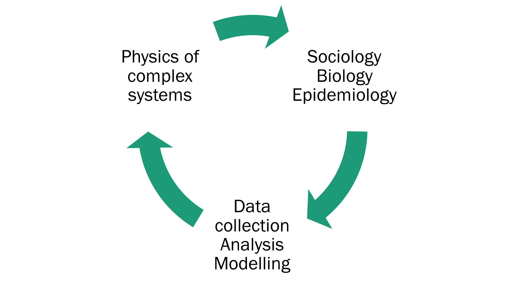
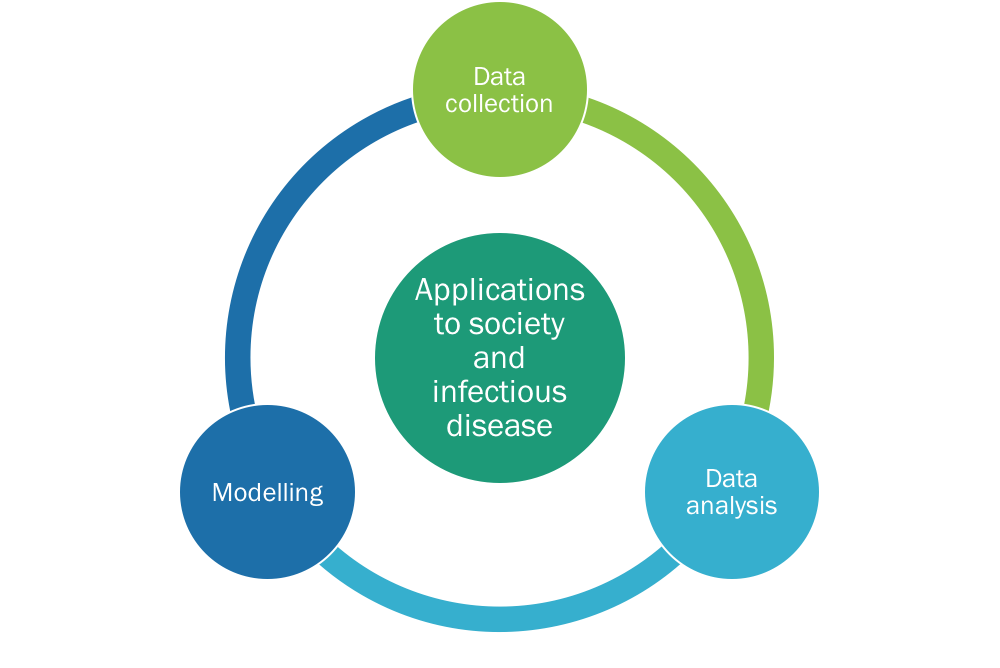

<!--
<style type="text/css">
.title {
  display: none;
}

#getting-started img {
  margin-right: 10px;
}

</style>

<div class="row" style="padding-top: 30px;">
<div class="col-sm-6">

### Senior Lecturer in Data Analytics {style="padding-top: 0px;"}

I am an interdisciplinary scientist interested in collective behaviour and complex systems. I like studying human populations, contacts and social networks. My research is often motivated by the study of large, relevant datasets In particular, I am interested in infectious disease epidemiology and the interplay between human behaviour and disease transmission at all spatial and temporal scales. 

Below is a network of (most of)  my papers and scientific collaborators involved. Circles indicate authors, and boxes indicate papers. The size of the box is indicative of the number of citations, and the size of the circle is indicative of author name length. 

</div>
<div class="col-sm-6">


<!--[](images/RMarkdownOutputFormats.png)-->
<!-- comment -->


```{r,echo=FALSE}
knitr::opts_chunk$set(echo = FALSE)
knitr::opts_chunk$set(warning = FALSE)
knitr::opts_chunk$set(message = FALSE)
```



```{r}
library(scholar)
library(stringi)
library(stringr)
library(dplyr)
library(reshape2)
library(visNetwork)
library(RColorBrewer)

```

```{r}
#let's try downloading and reading scopus export csv


papers<-read.csv("scopus_edits.csv")

lcol=length(unique(papers$Theme))

palette<-brewer.pal(lcol,"Set3")


as.character(papers$Author)%>%strsplit(', ')->aulinks

meltedlinks<-melt(aulinks) # create a melted versio of coauthor links
meltedlinks%>%filter(!grepl('\\.',value))->meltedlinks # remove initials. 
meltedlinks$value<-stri_trans_general(meltedlinks$value,"Latin-ASCII") # get rid of annoying accents

aull <- data.frame(from = papers$Title[as.numeric(meltedlinks$L1)], to = meltedlinks$value) # make link list for authors and papers. 

#papers%>%select(id=Title,DOI,value = Cited.by,Source.title,Year)-> papernodes
papers$group="Paper"
papers$shape = "square"
papers$tooltip <- paste0(papers$Title,"<br>",
    papers$Source.title,"<br>",
  "(",papers$Year,")<br>",
  "<a href=http://dx.doi.org/",papers$DOI,"> DOI:",papers$DOI,"</a><br>",
  papers$Theme
)
papers$color= palette[papers$Theme]
papers%>%select(id=Title,group,value = Cited.by,title=tooltip,color)->papernodes


aull%>%select(id=to)%>%distinct(id)->aunodes
aunodes$group="Author"
aunodes$title <- paste0(aunodes$id)
aunodes$value = 1
aunodes$color = 'pink'
nodes<-data.frame(rbind(papernodes,aunodes))

net<-visNetwork(nodes, aull, width = "100%",height = "800px") %>%
  visNodes(scaling = list(min = 20, max = 100)) %>%
  #visGroups(groupname = "Author", shape = "circle") %>%
  #visGroups(groupname = "Paper", shape = "square",color = list(background = 'grey', border = 'black')) %>%
  visGroups(groupname = "Paper", shape = "square") %>%
  visOptions(highlightNearest = TRUE)%>% 
  visInteraction(hover = FALSE,tooltipDelay = 0)%>%
  visIgraphLayout(randomSeed=20,type="full",smooth=TRUE,physics = TRUE)
  #visLegend(width = 0.1)#%>%
  #visPhysics(solver = "barnesHut",stabilization = TRUE,barnesHut = list(avoidOverlap = 0.05))


visSave(net,"collab.html")
```

